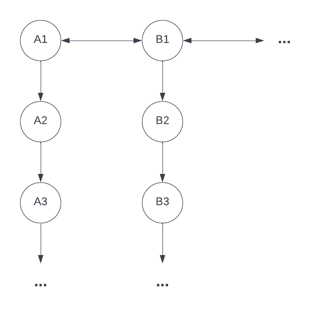

# Data Structure for conCURRENCY
**Authors:** Matthew Bouch and Trevor Mitchell

## 1. Data Structure
The data strcuture for conCURRENCY needs to allow each block to know about previous blocks on the chain and as well needs to have each chain know about older chains to allow for seemless updating.

This visual shows the structure we have in mind for the datastructure. The A circles are at version 1 and going down is each new block on the chain. The B circles are version 2 and going down is new blocks on that version of the chain.

The way this will work implementation-wise is that the updates will be made to be knowledgeable about previous versions to the point where multiple chains can run at one time on different versions.